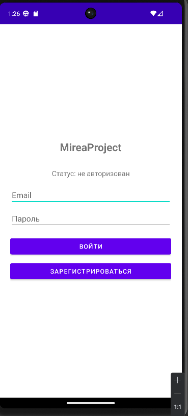
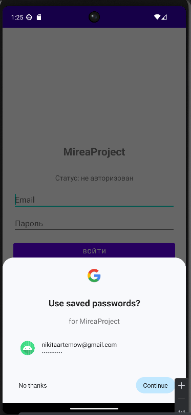
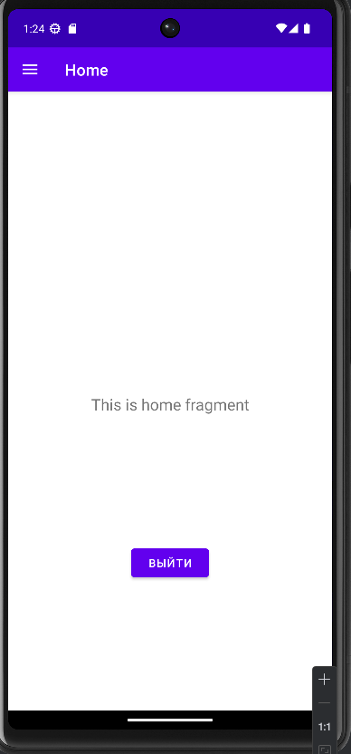
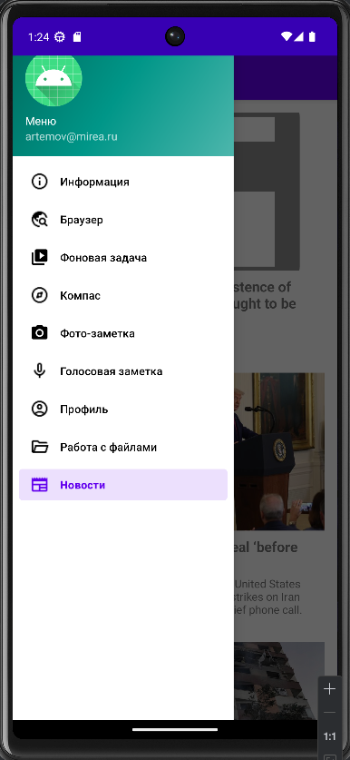
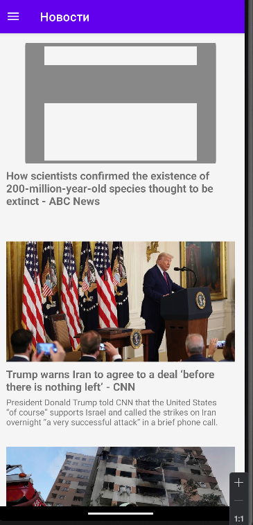
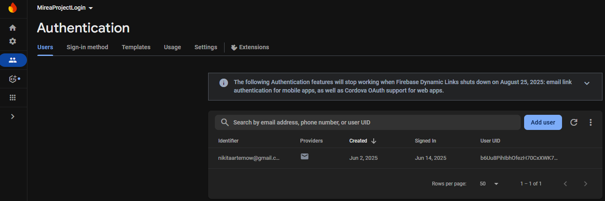

# Отчёт по практике 7 (Network Mirea Project)
- Очно у меня было не сдано второе задание mirea project - _"Добавить
фрагмент, отображающий любую информацию из сетевого ресурса._"

## Описание выполненных заданий

## 1. Регистрация и авторизация

- Подключен FirebaseAuth;
- Добавлена разметка для регистрации/авторизации;
- Добавлена функция автовхода при логине, также присутствует кнопка выхода из профиля

## 2. Фрагмент новостей

- В меню добавлен фрагмент новостей, подгружающий последние 10 новостей из указанного региона(в моем случае US).

## Скриншоты

